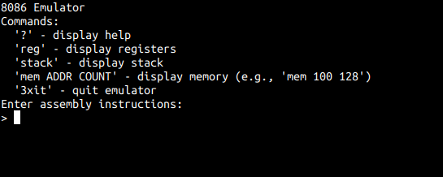
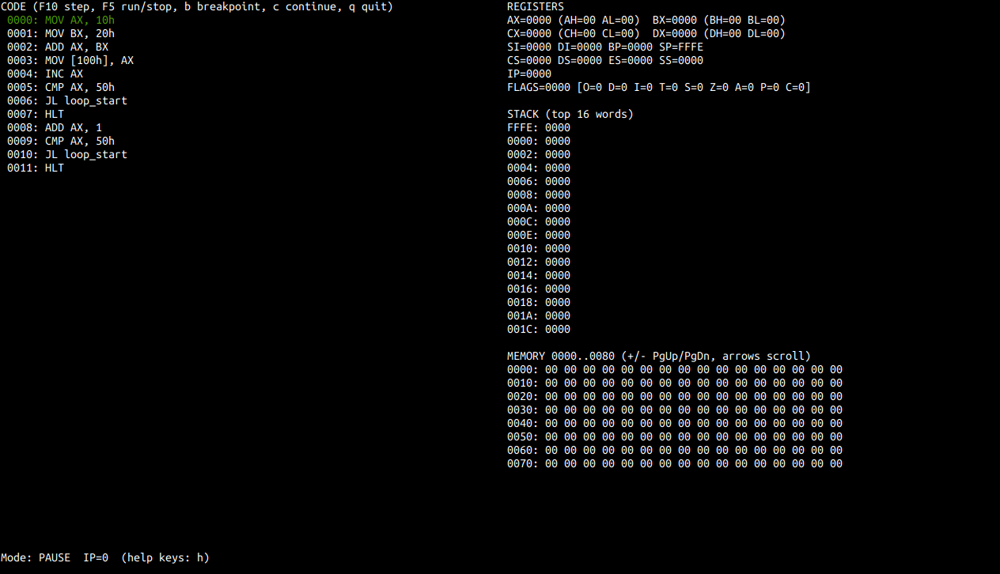

# 8086 Emulator

A comprehensive Intel 8086 microprocessor emulator with both GUI and TUI interfaces, featuring real-time debugging, memory inspection, and interactive assembly editing.



---



## Features

### Core Emulator

- **Complete 8086 instruction set** implementation
- **Real-time execution** with step-by-step debugging
- **Memory management** with 1MB addressable space
- **Register manipulation** including all general-purpose, index, and segment registers
- **Flag handling** with complete status flag support

### GUI Mode (SDL2 + ImGui)

- **Interactive assembly editor** with syntax highlighting and file operations
- **Real-time register viewer** with detailed flag status
- **Memory hex editor** with ASCII view and navigation
- **Step execution controls** with program loading
- **Cross-platform support** (Linux, macOS, Windows)
- **Keyboard shortcuts** for all major operations

### TUI Mode (ncurses)

- **Integrated development environment** with text editor
- **Terminal-based debugging** with breakpoint support
- **Memory and register inspection** in real-time
- **Program execution controls** with step and run modes

## Build Requirements

### Linux/Ubuntu

```bash
sudo apt-get install build-essential cmake libsdl2-dev libgl1-mesa-dev libncurses5-dev
```

### macOS

```bash
brew install cmake sdl2 ncurses
```

### Windows

- Visual Studio 2019+ or MinGW-w64
- CMake 3.16+
- SDL2 development libraries
- PDCurses for TUI support

## Building

### CMake Build (Recommended)

```bash
mkdir build && cd build
cmake .. -DCMAKE_BUILD_TYPE=Release
make -j$(nproc)
```

### Build Options

- `CMAKE_BUILD_TYPE=Debug|Release` - Build configuration
- `BUILD_TESTS=ON|OFF` - Enable/disable test suite
- `BUILD_GUI=ON|OFF` - Force enable/disable GUI (auto-detected)
- `BUILD_TUI=ON|OFF` - Force enable/disable TUI (auto-detected)

### Development Build

```bash
mkdir build && cd build
cmake .. -DCMAKE_BUILD_TYPE=Debug -DBUILD_TESTS=ON
make -j$(nproc)
make test  # Run test suite
```

## Usage

### Command Line Interface
```bash
./8086emu                    # Interactive REPL mode
./8086emu --help            # Show usage information
```

### GUI Mode
```bash
./8086emu --gui                        # Launch GUI
./8086emu --gui program.asm           # Launch GUI with assembly file
```

**GUI Keyboard Shortcuts:**
- `F2` - Toggle registers window
- `F3` - Toggle memory window  
- `F4` - Toggle assembly editor
- `F7` - Step execute instruction
- `Ctrl+R` - Reset emulator
- `Ctrl+L` - Load program into emulator
- `Ctrl+Enter` - Assemble and load (in editor)
- `ESC` - Exit application

### TUI Mode
```bash
./8086emu --ide                        # Launch IDE mode
./8086emu --tui program.asm           # Launch TUI debugger with file
```

**TUI Controls:**
- `F5` - Run/pause program
- `F10` - Step execute
- `b` - Toggle breakpoint
- `c` - Continue execution
- `l` - Toggle labels view
- `q` - Quit
- Arrow keys - Navigate memory/code
- `PgUp/PgDn` - Scroll memory view

## Assembly Programming

### Supported Instructions

The emulator supports the complete 8086 instruction set including:

- **Data Transfer:** MOV, PUSH, POP, XCHG, LEA, LDS, LES, LAHF, SAHF, PUSHF, POPF
- **Arithmetic:** ADD, ADC, INC, AAA, DAA, SUB, SBB, DEC, NEG, AAS, DAS, MUL, IMUL, DIV, IDIV
- **Logical:** AND, OR, XOR, NOT, TEST, SHL, SHR, SAL, SAR, ROL, ROR, RCL, RCR
- **String:** MOVSB, MOVSW, CMPSB, CMPSW, SCASB, SCASW, LODSB, LODSW, STOSB, STOSW
- **Program Transfer:** JMP, JE, JNE, JZ, JNZ, JC, JNC, JS, JNS, JO, JNO, CALL, RET
- **Processor Control:** CLC, STC, CMC, CLD, STD, CLI, STI, HLT, NOP

### Example Program
```assembly
; Simple addition program
MOV AX, 10h      ; Load 16 into AX
MOV BX, 20h      ; Load 32 into BX  
ADD AX, BX       ; Add BX to AX (result: 30h)
MOV CX, AX       ; Copy result to CX
HLT              ; Halt execution
```

## Testing

### Run All Tests
```bash
cd build
make test-all
```

### Individual Test Suites
```bash
make test          # Core emulator tests
make test-gui      # GUI component tests
```

### Test Coverage
- Core emulator instruction execution
- Register and memory operations
- Program loading and step execution
- GUI component initialization and safety

## Development

### Code Style
The project uses clang-format with Google style (modified). Format code with:
```bash
find src include tests -name "*.cpp" -o -name "*.h" | xargs clang-format -i
```

### Static Analysis
Run clang-tidy for code quality checks:
```bash
cd build
clang-tidy -p . ../src/*.cpp
```

### Contributing
1. Follow the existing code style
2. Add tests for new functionality
3. Ensure all tests pass
4. Update documentation as needed

## Architecture

### Core Components
- **Emulator8086**: Main emulator class with instruction execution
- **Registers**: 8086 register set implementation  
- **Memory**: 1MB linear memory model
- **Instructions**: Modular instruction set implementation

### GUI Architecture
- **GUIApplication**: Main application class using SDL2/ImGui
- **Window Management**: Modular window system for different views
- **Event Handling**: Keyboard shortcuts and user interactions

### TUI Architecture  
- **EmulatorTUI**: Debugging interface using ncurses
- **EmulatorIDETUI**: Integrated development environment with editor

## License

This project is open source. See LICENSE file for details.

## Acknowledgments

- Built with [Dear ImGui](https://github.com/ocornut/imgui) for GUI
- Uses [SDL2](https://www.libsdl.org/) for cross-platform windowing
- TUI powered by [ncurses](https://invisible-island.net/ncurses/)
