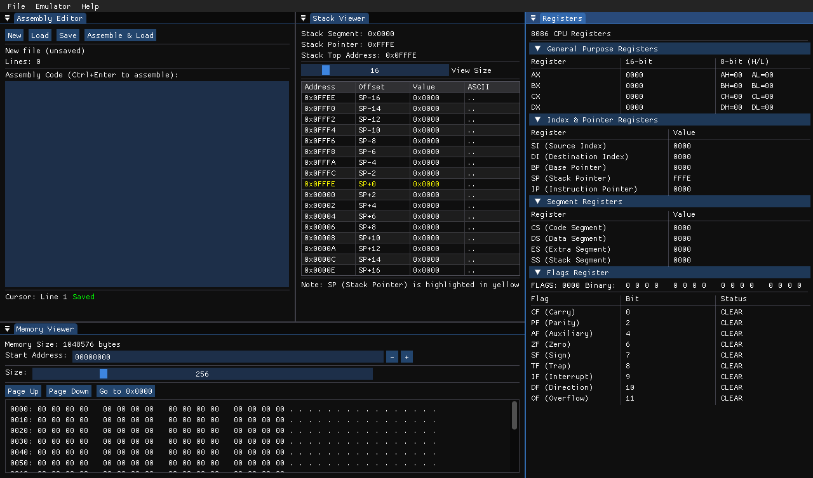

# Im8086

A simple Intel 8086 microprocessor emulator for educational purposes, with both GUI and TUI interfaces.

## Gallery


---


---



## Requirements

### Linux/Ubuntu

```bash
sudo apt-get install build-essential cmake libsdl2-dev libgl1-mesa-dev libncurses5-dev
```

### macOS

```bash
brew install cmake sdl2 ncurses
```

### Windows

- Visual Studio 2019+ or MinGW-w64
- CMake 3.16+
- SDL2 development libraries
- PDCurses for TUI support

## Building

```bash
mkdir build && cd build
cmake .. -DCMAKE_BUILD_TYPE=Release
make -j$(nproc)
```

## Usage

### Basic Commands

```bash
./Im8086                # Start emulator
./Im8086 --help         # Show help
./Im8086 --gui          # Start in GUI mode
./Im8086 --tui program.asm  # Start in TUI mode with program
```

### GUI Mode Shortcuts

- `F7` - Step execute instruction
- `Ctrl+R` - Reset emulator
- `Ctrl+L` - Load program
- `ESC` - Exit application

### TUI Mode Controls

- `F5` - Run/pause program
- `F10` - Step execute
- `q` - Quit

## Educational Project

This project is strictly for educational purposes to help understand 8086 architecture and emulation. As this is a personal learning project, no pull requests will be accepted.
